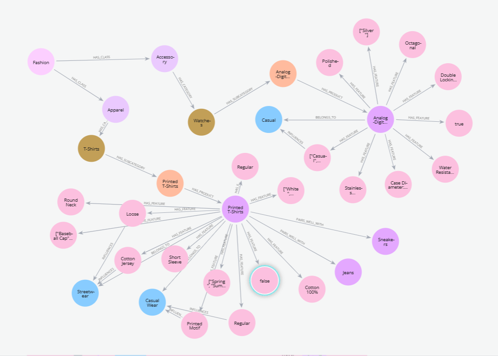

# Automated Knowledge Graph Construction

Welcome to the Automated Knowledge Graph Construction project, developed during the Stylumia Hackathon. This project aims to streamline the creation of knowledge graphs by integrating a React-based frontend with a Flask backend, utilizing Apache Kafka for efficient data processing.

## Table of Contents

- [Sample Output](#sample-output)
- [Project Structure](#project-structure)
- [Setup Instructions](#setup-instructions)
  - [1. Running the React Application](#1-running-the-react-application)
  - [2. Setting Up Apache Kafka with Docker](#2-setting-up-apache-kafka-with-docker)
  - [3. Running the Flask Application](#3-running-the-flask-application)
- [Additional Notes](#additional-notes)
- [License](#license)

## Sample Output



*An example ontology generated for two products.*

## Project Structure

```
Stylumia-Hackathon/
├── frontend/                     # React-based frontend
│   ├── src/                      # Source files for the React app
│   ├── .bolt/                    # Configuration files
│   ├── package.json              # Node.js project metadata
│   └── vite.config.ts            # Vite configuration
├── generate-description/         # Backend-related scripts
│   ├── flask_app/                # Flask-based backend API
│   └── myenv/                    # Python virtual environment
├── docker-compose.yml            # Docker Compose setup for Apache Kafka
├── unifashionLLM.ipynb           # Code for loading and fine-tuning the LLava model with LoRA
└── README.md                     # Project documentation
```

## Setup Instructions

To set up and run the project locally, follow these steps:

### 1. Running the React Application

1. **Navigate to the `frontend` directory:**

   ```bash
   cd frontend
   ```

2. **Install dependencies:**

   ```bash
   npm install
   ```

3. **Start the development server:**

   ```bash
   npm run dev
   ```

4. **Access the application:**

   Open your browser and navigate to `http://localhost:5173`.

### 2. Setting Up Apache Kafka with Docker

1. **Ensure Docker is installed and running on your system.**

2. **Navigate to the root of the project directory:**

   ```bash
   cd ..
   ```

3. **Start the Kafka services using Docker Compose:**

   ```bash
   docker-compose up -d
   ```

4. **Verify that Kafka is running:**

   ```bash
   docker ps
   ```

   Ensure the Kafka container is listed and running.

### 3. Running the Flask Application

1. **Navigate to the `kg-construct` directory:**

   ```bash
   cd generate-description
   ```

2. **Create a virtual environment (if not already done):**

   ```bash
   python -m venv myenv
   ```

3. **Activate the virtual environment:**

   - On macOS/Linux:

     ```bash
     source myenv/bin/activate
     ```

   - On Windows:

     ```bash
     myenv\Scripts\activate
     ```

4. **Navigate to the `flask_app` directory:**

   ```bash
   cd flask_app
   ```

5. **Install required Python dependencies:**

   ```bash
   pip install -r requirements.txt
   ```

6. **Start the Flask application:**

   ```bash
   python app.py
   ```

   Ensure the Kafka container is running for proper Flask-Kafka integration.

## Additional Notes

- **Prerequisites:**
  - Ensure [Node.js](https://nodejs.org/) and [Python](https://www.python.org/) are installed on your machine.
  - Make sure Docker is properly configured and has access to the necessary resources (memory, CPU).

- **Service Dependencies:**
  - The Flask application communicates with Kafka; thus, Kafka must be running before starting the Flask app.


